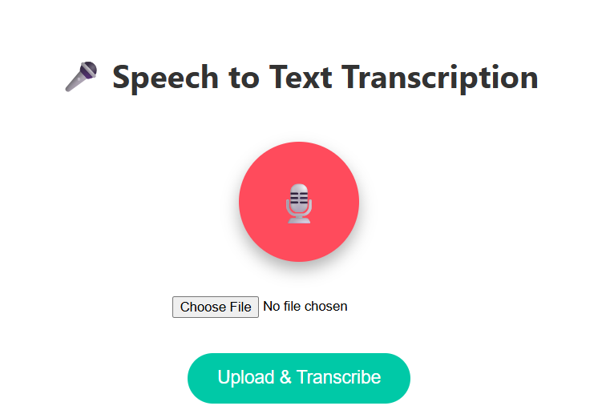

# 🎤 Speech to Text Converter  

A web-based application that converts spoken audio into text using **JavaScript** and the **Web Speech API**. This project provides a simple and interactive way to transcribe speech directly in the browser.  

  

---
## ✨ Features  

- 🎙 *Real-time speech recognition* using Web Speech API  
- 📝 *Transcribes spoken words* into editable text  
- 📋 *Copy text* feature for easy usage  
- 🌐 *Runs directly in browser* — no installation needed  
- 📱 *Responsive design* for desktop and mobile  

---

## 📦 Project Structure  
speech-to-text-converter/
├── index.html # Main HTML file
├── style.css # CSS styles
├── script.js # JavaScript logic
└── README.md # Project documentation

---

## 🚀 Getting Started  

1. **Clone the repository**  
   ```bash
   git clone https://github.com/delljigyanshu/speech-to-text-converter.git
   cd speech-to-text-converter
      ```
2. **Run the app**
  ```bash
Open index.html in your browser.
Click the microphone button and start speaking to see real-time transcription.
   ```

##🛠 Built With

HTML5

CSS3

JavaScript (Vanilla)

Web Speech API

##✏ Customization Ideas

🎨 Add dark/light theme toggle

🌍 Support multiple languages for speech recognition

💾 Option to download transcribed text as .txt or .docx file

🔊 Add speech-to-speech translation by integrating with translation APIs

🙋‍♂ Author

Jigyanshu Agrawal

GitHub:[@delljigyanshu](https://github.com/delljigyanshu/speech-to-text-converter)

LinkedIn: [Jigyanshu Agrawal](https://www.linkedin.com/in/jigyanshu-agrawal?utm_source=share&utm_campaign=share_via&utm_content=profile&utm_medium=android_app )
